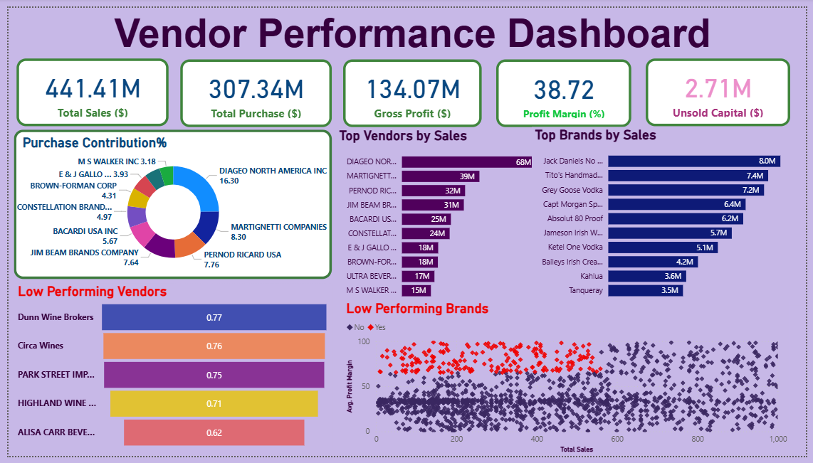

# Vendor Performance Analysis - Retails Inventory & Sales

_Analyzing vendor efficiency and profitability to support strategic purchasing and inventory decisions
using SQL, Python, and Power Bl._

## Table of Contents
- [Overview](#overview)
- [Business Problem](#business_problem)
- [Dataset](#dataset)
- [Tools & Technologies](#tools--technologies)
- [📂 Project Structure](#--project_structure)
- [Data Cleaning & Preparation](#data-cleaning--preparation)
- [Exploratory Data Analysis (EDA)](#exploratory-data-analysis--eda)
- [Research Questions & Key Findings](#research_questions--key_findings)
- [Dashboard](#dashboard)
- [How to Run This Project](#how_to_run_this_project)
- [Final Recommendation](#final_recommendation)
- [Author & Contact](#author--contact)

# Overview

This project evaluates vendor performance and retail inventory dynamics to drive strategic insights for
purchasing, pricing, and inventory optimization. A complete data pipeline was built using SQL for ETL,
Python for analysis and hypothesis testing, and Power BI for visualization.

# Business Problem

Effective inventory and sales management are critical in the retail sector. This project aims to:
- Identify underperforming brands needing pricing or promotional adjustments
- Determine vendor contributions to sales and profits
- Analyze the cost—benefit of bulk purchasing
- Investigate inventory turnover inefficiencies
- Statistically validate differences in vendor profitability

# Dataset

- dataset link is in '/data/' folder consists of zip file in which (sales, inventory, vendors) csv files are compressed.
- Sumary table created from ingested data and used for analysis

# Tools & Technologies
- SQL (Common Table Expressions, Joins, Filtering)
- Python (Pandas, Matplotlib, Seaborn, SciPy)
- Power BI (Interactive Visualizations)
- GitHub

## 📂 Project Structure
````
vendor-performance-analysis/
│
├── 📄 README.md
├── 🛑 .gitignore
├── 📦 requirements.txt
├── 📑 vendor_performance_report.pdf
│
├── 📓 notebooks/       # Jupyter notebooks
│ ├── 📘 exploratory_data_analysis.ipynb
│ └── 📗 vendor_performance_analysis.ipynb
│
├── 🐍 scripts/         # Python scripts for ingestion and processing
│ ├── 📜 ingestion_db.py
│ └── 📜 get_vendor_summary.py
│
├── 📊 outputs/         # CSV file for further analysis
│ └── 📄 vendor_sales_summary.csv
│
├── 📈 dashboard/       # Power BI dashboard file
│ └── 📊 vendor_performance.pbix
````


# Data Cleaning & Preparation

-  Removed transactions with:
   - Gross Profit ≤ 0
   - Profit Margin ≤ 0
   - Sales Quantity = 0
- Created summary tables with vendor-level metrics
- Converted data types, handled outliers, merged lookup tables

---
# Exploratory Data Analysis (EDA)

**Negative or Zero Values Detected:**
 - Gross Profit: Min -52,002.78 (loss-making sales)
 - Profit Margin: Min -∞ (sales at zero or below cost)
 - Unsold Inventory: Indicating stow—moving stock

**"Outliers Identified:"**
 - High Freight Costs (up to 257K)
 - Large Purchase/Actuat Prices

**"Correlation Analysis:"**
 - Weak between Purchase Price & Profit
 - Strong between Purchase Qty & Sates Qty (0.999)
 - Negative between Profit Margin & Sales Price (-0.179)
---

# Research Questions & Key Findings

1.**Brands for Promotions**: 198 brands with low sales but high profit margins

2.**Top Vendors**: Top 10 vendors = 65.698 of purchases -- risk of over—reliance

3.**Bulk Purchasing Impact**: 72% cost savings per unit in large orders

4.**Inventory Turnover**: $2.71M worth of unsold inventory

5.**Vendor Profitability**:
  - High Vendors: Mean Margin = 31.17%
  - Low Vendors: Mean Margin = 41.55%

6.**Hypothesis Testing**: Statistically significant difference in profit margins -- distinct vendor
strategies

# Dashboard

- Power BI Dashboard shows:
  - Vendor—wise Sales and Margins
  - Inventory Turnover
  - Bulk Purchase Savings
  - Performance Heatmaps



# How to Run This Project

1. Clone the repository:
``` bash
git clone https://qithub.com/yourusername/vendor—performance—anatysis.git
```
2. Load the CSVs and ingest into database:
```bash
python scripts/ ingestion_db.py
```
3. Create vendor summary table:
```bash
python scripts/get_vendor_summary.py
```
4. Open and run notebooks:
  - 'notebooks/exploratory_data_analysis.ipynb'
  - 'notebooks/vendor_performance_analysis.ipynb'
5. Open Power BI Dashboard:
  - 'dashboard/vendor_performance.pbix'

# Final Recommendations

- Diversify vendor base to reduce risk
- Optimize bulk order strategies
- Reprice stow-moving, high-margin brands
- Clear unsold inventory strategically
- Improve marketing for underperforming vendors

# Author & Contact

**Prateek Mehra**

Data Analyst

Email - prateek.mehra2112@gmail.com

[LinkedIn](wwww.linkedin.com/in/prateekmehrads/)

